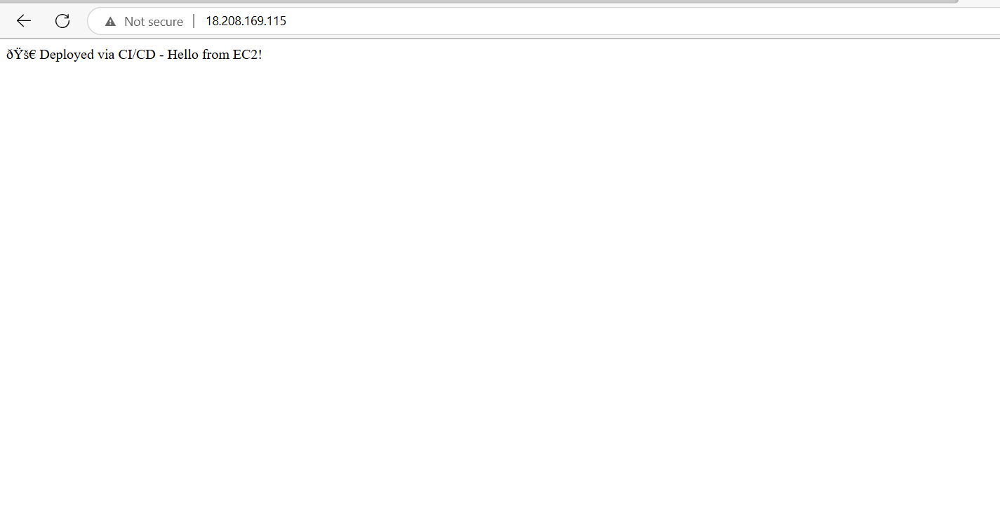
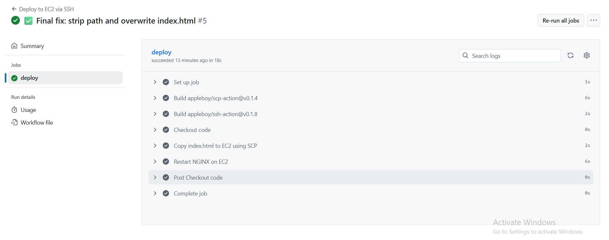

# CI/CD Deployment to EC2 using GitHub Actions

This project automatically uploads a simple website (index.html) to an EC2 server using GitHub Actions.

---

## Tools Used
- GitHub
- GitHub Actions
- AWS EC2 (Ubuntu)
- NGINX

---

## Steps

1. Push code to GitHub.
2. GitHub Actions runs a workflow.
3. It sends index.html to EC2 using SSH.
4. NGINX shows the page.

---

## GitHub Secrets

Set these:
- `EC2_PUBLIC_IP`
- `SSH_USERNAME`
- `SSH_PRIVATE_KEY`

---

## Files in This Repo

cicd-xops/
├── index.html
├── .github/workflows/deploy.yml
├── Screenshot/ (optional)
└── README.md

yaml
Copy
Edit

---

## Output Screenshots

## 📷 Screenshots

### ✅ Deployed Web Page

### 🟢 GitHub Actions Success

---

## By
Pradhyumna Raghavendra 
GitHub: https://github.com/pradhyupradhyumna
